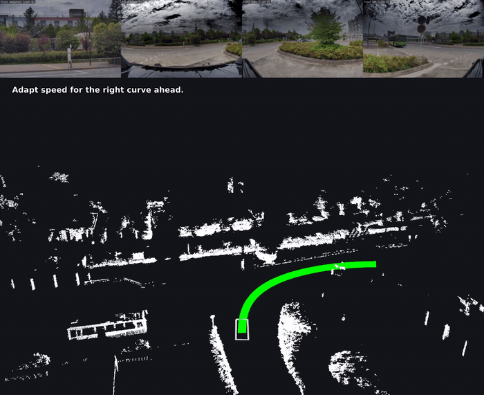

# Alpamayo ROS 2 Node Usage Guide


This guide explains how to set up and run the Alpamayo ROS 2 node.

This branch adds a second node for **Alpamayo 2 Super** on top of `main`; see
[Alpamayo 2 Super](#alpamayo-2-super) below. The TensorRT-accelerated Alpamayo 1.5 node lives
on the `alpamayo1.5` branch.

## Prerequisites

| Requirement | Specification                                |
| ----------- | -------------------------------------------- |
| **Python**  | 3.10.x (for compatibility with ROS 2 Humble) |
| **ROS 2**   | Humble (must be installed)                   |
| **GPU**     | NVIDIA GPU (24 GB+ VRAM recommended)         |
| **OS**      | Linux (tested)                               |

## Setup Instructions

### 1. Install uv

If not already installed, install uv using the following command:

```bash
curl -LsSf https://astral.sh/uv/install.sh | sh
export PATH="$HOME/.local/bin:$PATH"
```

### 2. Create Virtual Environment with Python 3.10

**Important**: You must use Python 3.10 for compatibility with ROS 2 Humble.

Remove any existing venv and recreate it with Python 3.10:

```bash
# Remove existing venv (if it exists)
rm -rf a1_5_venv

# Create new venv with Python 3.10
uv venv a1_5_venv --python python3.10

# Activate the virtual environment
source a1_5_venv/bin/activate

# Install dependencies
uv sync --active
```

### 3. HuggingFace Authentication

Request access to the Alpamayo model and dataset:

- [Physical AI AV Dataset](https://huggingface.co/datasets/nvidia/PhysicalAI-Autonomous-Vehicles)
- [Alpamayo Model Weights](https://huggingface.co/nvidia/Alpamayo-1.5-10B)

Once access is granted, authenticate using the HuggingFace CLI:

```bash
# Install HuggingFace Hub (if not already installed)
pip install huggingface_hub

# Login with your token
huggingface-cli login
```

You can obtain your access token at: <https://huggingface.co/settings/tokens>

## Running the ROS 2 Node

### Method 1: Direct Script Execution (Recommended)

Source the ROS 2 environment and run the node using Python from the virtual environment:

```bash
# Source ROS 2 environment
source /opt/ros/humble/setup.bash

# Source Autoware environment (need to change correct path)
source ~/workspace/autoware/install/setup.bash

# Activate virtual environment
source a1_5_venv/bin/activate

# Run the node
python3 ./src/alpamayo_ros/alpamayo_ros/alpamayo_node.py --ros-args \
  -p camera_topics:="['/sensing/camera/camera3/image_raw/compressed', '/sensing/camera/camera1/image_raw/compressed', '/sensing/camera/camera4/image_raw/compressed', '/sensing/camera/camera2/image_raw/compressed']" \
  -p camera_indices:="[0, 1, 2, 6]"

# Run the node (rosbag mode)
# python3 ./src/alpamayo_ros/alpamayo_ros/alpamayo_node.py --ros-args \
#   -p camera_topics:="['/sensing/camera/camera3/image_raw/compressed', '/sensing/camera/camera1/image_raw/compressed', '/sensing/camera/camera4/image_raw/compressed', '/sensing/camera/camera2/image_raw/compressed']" \
#   -p camera_indices:="[0, 1, 2, 6]" \
#   -p use_sim_time:=true

```

### Method 2: Using colcon Build

If you want to build as a ROS 2 package using colcon:

```bash
# Source ROS 2 environment
source /opt/ros/humble/setup.bash

# Source Autoware environment (need to change correct path)
source ~/workspace/autoware/install/setup.bash
# Activate virtual environment
source a1_5_venv/bin/activate

# Build the package
colcon build --packages-select alpamayo_ros --symlink-install

# Source the workspace
source install/setup.bash

# Run the node
python3 ./src/alpamayo_ros/alpamayo_ros/alpamayo_node.py --ros-args \
  -p camera_topics:="['/sensing/camera/camera3/image_raw/compressed', '/sensing/camera/camera1/image_raw/compressed', '/sensing/camera/camera4/image_raw/compressed', '/sensing/camera/camera2/image_raw/compressed']" \
  -p camera_indices:="[0, 1, 2, 6]"

# Run the node (rosbag mode)
# python3 ./src/alpamayo_ros/alpamayo_ros/alpamayo_node.py --ros-args \
#   -p camera_topics:="['/sensing/camera/camera3/image_raw/compressed', '/sensing/camera/camera1/image_raw/compressed', '/sensing/camera/camera4/image_raw/compressed', '/sensing/camera/camera2/image_raw/compressed']" \
#   -p camera_indices:="[0, 1, 2, 6]" \
#   -p use_sim_time:=true

```

### Method 3: Using Launch File

If a launch file is available:

```bash
# Source ROS 2 environment and workspace
source /opt/ros/humble/setup.bash
source a1_5_venv/bin/activate

# Source Autoware environment (need to change correct path)
source ~/workspace/autoware/install/setup.bash

# Run the launch file
ros2 launch alpamayo_ros alpamayo.launch.py
```

## Parameters

The Alpamayo node can be configured with the following ROS parameters:

| Parameter | Default Value | Description |
| --- | --- | --- |
| `camera_topics` | (required) | List of camera image topics (CompressedImage type) |
| `camera_indices` | (required) | Camera index for each topic (0=Front left, 1=Front, 2=Front right, 3=Rear left, 4=Rear, 5=Rear right, 6=Front telephoto) |
| `odometry_topic` | `/localization/kinematic_state` | Odometry topic |
| `trajectory_topic` | `/alpamayo/predicted_trajectory` | Output topic for predicted trajectory |
| `cot_topic` | `/alpamayo/reasoning` | Output topic for reasoning trace |
| `cot_with_stamped_topic` | `/alpamayo/reasoning_stamped` | Output topic for timestamped reasoning trace |
| `inference_period_sec` | `0.1` | Inference execution period (seconds) |
| `use_sim_time` | `false` | Whether to use simulation time |

## Troubleshooting

### Python Version Mismatch

If you see error message `ModuleNotFoundError: No module named 'rclpy._rclpy_pybind11'`:

- Cause: The venv was created with a Python version other than 3.10
- Solution: Follow step 2 above to recreate the venv with Python 3.10

### CUDA Out-of-Memory Errors

If you encounter memory errors:

1. Ensure you're using a GPU with at least 24 GB VRAM
2. Close other GPU-intensive applications
3. Increase the inference period (`inference_period_sec`)

### Flash Attention Issues

If you encounter compatibility issues with Flash Attention 2, you can use an alternative implementation in the model code:

```python
config.attn_implementation = "sdpa"
```

### Slow Model Download

On first run, the model weights (approximately 22 GB) will be downloaded. This can take time depending on your connection speed (approximately 2.5 minutes on a 100 MB/s connection).

## Output Topics

The node publishes the following topics:

- `/alpamayo/predicted_trajectory` (autoware_planning_msgs/Trajectory): Predicted vehicle trajectory
- `/alpamayo/reasoning` (std_msgs/String): Chain-of-Causation reasoning text
- `/alpamayo/reasoning_stamped` (autoware_internal_debug_msgs/StringStamped): Timestamped reasoning text
- `/alpamayo/predicted_trajectory_markers` (visualization_msgs/MarkerArray): Visualization markers for RViz

## Alpamayo 2 Super



*Four of the six camera views the model consumes, its chain-of-causation text, and the 6.4 s
trajectory it predicts, over a replayed Autoware rosbag. The trajectory is replanned about every
0.5 s of scene time; this is not a real-time recording — see [Latency](#latency).*

[Alpamayo 2 Super](https://huggingface.co/nvidia/Alpamayo2-Super) is a 34B model (32B Qwen3-VL
backbone + 2B flow-matching action expert). It runs as a second node in this package,
`alpamayo2_node`, alongside the 1.5 node, and uses `alpamayo_ros/conversions.py` for the
Autoware/RViz message building and the odometry-history transform.

### Differences from 1.5

| | Alpamayo 1.5 | Alpamayo 2 Super |
|---|---|---|
| Parameters | 10B | 34B (32B VLM + 2B expert) |
| Weights on disk | ~21 GB | ~72 GB (bf16) |
| Cameras | 4, configurable | **exactly 6**, IDs `(0, 1, 2, 3, 5, 6)` ascending |
| Frames per camera | 4 | 4 |
| Trajectory horizon | 20 points / 2.0 s | **64 points / 6.4 s** |
| Ego history | 16 poses @ 10 Hz | 16 poses @ 10 Hz |
| TensorRT expert | Yes (`expert_onnx_path`) | No |
| Navigation conditioning | Yes (CFG) | Optional, experimental — see below |

### Prerequisites

| Requirement | Specification |
| --- | --- |
| **GPU** | One NVIDIA GPU with **80 GB+ VRAM**. Developed on an RTX PRO 6000 Blackwell (96 GB); peak usage is 69.1 GiB. |
| **CUDA** | Required. There is no CPU path: JPEG decode runs on the GPU and inference uses `torch.autocast`. |
| **Autoware** | A built Autoware workspace is **mandatory** — the node imports `autoware_planning_msgs` and `autoware_internal_debug_msgs` at module load, so a plain ROS 2 Humble install fails before the node starts. |
| **Disk** | ~72 GB for the weights, plus the HuggingFace cache. |

The 3.10 virtual environment from [Setup Instructions](#setup-instructions) above covers the
model package as well; no extra dependencies are needed. `attn_implementation="sdpa"` is passed
explicitly because flash-attn 2.8.3 ships no `sm_120` (Blackwell) kernels.

### Running

```bash
# From the repository root, with the venv from the setup step above
./run_alpamayo2_node.sh

# Or through the launch file, which declares every parameter as a launch argument
ros2 launch alpamayo_ros alpamayo2.launch.py inference_period_sec:=1.0
```

The script runs the node straight from the source tree: `alpamayo2_super` is imported via
`PYTHONPATH` rather than installed as a package. Set `VENV` to use a virtual environment other
than the `a1_5_venv` created above, and `AUTOWARE_WS` to point at your Autoware workspace.

On the first inference the node logs its ego-history check, which is the quickest confirmation
that the input plumbing is correct:

```
ego history OK: t0_at_origin=0.00e+00, t0_rot_identity=2.30e-08,
implied_v0=5.03m/s, early_v=3.87m/s, odom_v0=4.78m/s (diff=0.25)
```

**Velocity is not a model input.** The action space differentiates the 16-pose history to
estimate it, so a jittery or wrongly-framed history silently corrupts the whole rollout — which
is why `implied_v0` is logged against odometry's `odom_v0`. If those disagree, suspect the
odometry topic or its rate before suspecting the model.

### Visualizing in RViz

No RViz config ships with this branch. To see the output, set Fixed Frame to `map` and add:

- **MarkerArray** on `/alpamayo/predicted_trajectory_markers` — the trajectory line, the ego
  outline and the chain-of-causation text
- **Image** displays on the camera topics the node consumes (they are `CompressedImage`, so use
  `image_transport republish` if your RViz build cannot read them directly)
- **Odometry** on `/localization/kinematic_state`

### Latency

Measured over 304 inferences on one RTX PRO 6000 Blackwell (96 GB), six cameras at 10 Hz:

| | |
|---|---|
| Model load | 28.6 s |
| Inference | 3.35 s mean, 3.29 s median, 3.97 s p90, 6.24 s max |
| Peak VRAM | 69.1 GiB |

**This node is not usable closed-loop, and the demo above is not evidence that it is.** At
seconds per inference the trajectory is already stale when it is published, so trajectory
headers carry the *input* `t0` stamp rather than "now", letting consumers measure that staleness.
Chain-of-causation decode dominates the time, which makes `max_generation_length` the biggest
lever — but cutting it too far truncates generation before the trajectory-start token and breaks
CoT parsing.

### Alpamayo 2 Super parameters

| Parameter | Default | Description |
|---|---|---|
| `model_name` | `nvidia/Alpamayo2-Super` | HuggingFace model ID or local path |
| `camera_topics` | six topics | One per camera ID, same order as `camera_indices` |
| `camera_indices` | `[0, 1, 2, 3, 5, 6]` | Must be exactly this set, ascending |
| `inference_period_sec` | `2.0` | Timer period; ticks are dropped while an inference is in flight |
| `max_generation_length` | `256` | CoT token budget. Biggest latency lever |
| `num_diffusion_steps` | `10` | Flow-matching Euler steps |
| `max_image_long_side` | `1280` | Downscale before the processor, which reduces to ~196k px anyway |
| `marker_z_offset` | `0.4` | Lifts the trajectory line off the ground plane in RViz |
| `ego_footprint` | `[4.77, 1.73, 1.03]` | Outline at `base_link`: length, width, rear overhang. `0` length draws nothing |
| `max_frame_age_sec` | `3.0` | Skip inference on stale buffers, e.g. after a replay ends |
| `skip_on_bad_history` | `true` | Skip the tick when the ego history fails its invariants |
| `drop_bad_trajectory` | `true` | Drop rollouts whose waypoints do not start at the vehicle |
| `nav_cfg_enabled` | `false` | Navigation conditioning — see below |
| `lanelet2_map_path` | `""` | Required when `nav_cfg_enabled` |
| `route_topic` | `/planning/mission_planning/route` | Mission route, latched (transient-local) |
| `nav_guidance_weight` | `-1.0` | Negative uses the checkpoint's own weight (3.0) |

### Navigation conditioning (optional, experimental)

The 2B expert is conditioned only through the KV cache the VLM produces, so the only way to give
the model a route is to put the instruction into the VLM prompt. That instruction carries no
dedicated structure tokens, and the checkpoint was trained for classifier-free guidance, so the
navigation effect is meant to be *extrapolated* rather than merely conditioned on:

```
v = unguided_v + w * (guided_v - unguided_v)     # w = 3.0 in the checkpoint
```

`alpamayo_ros/nav_cfg.py` implements this by prefilling the VLM twice — once with the navigation
instruction and once without — and integrating the flow field against both caches. The
instruction text itself is derived from a lanelet2 map plus the mission route by
`alpamayo_ros/nav_text.py` ("Turn left in 30m", "Continue straight").

```bash
ros2 launch alpamayo_ros alpamayo2.launch.py \
    nav_cfg_enabled:=true \
    lanelet2_map_path:=<map_dir>/lanelet2_map.osm
```

This needs the `lanelet2` Python bindings and `autoware_lanelet2_extension_python` from your
Autoware workspace; without them the node fails at startup with an explicit message. Until a
route arrives the node keeps producing normal unguided rollouts rather than stalling.

Measured cost on one 96 GB card: peak VRAM 69.4 → 70.9 GiB and latency 3.35 → 5.2 s per
inference. That is cheaper than it sounds — Qwen3-VL's 8 KV heads over 64 layers make one
5k-token cache about 1.2 GiB, and the chain-of-causation decode is generated once by the guided
branch and replayed through the unguided prefix rather than paid twice. Upstream's own navigation
demo requires two 80 GB GPUs; one 96 GB card is enough.

**Why this is off by default.** Upstream declares classifier-free guidance unsupported for this
checkpoint, and measurement here agrees that it is not a usable steering control:

- At `nav_guidance_weight:=6` (double the checkpoint value) the rollout moves **under a metre**
- The direction is not reliably consistent with the instruction: on one frame "Turn left" and
  "Turn right" both moved the trajectory the same way
- A contradicting instruction cannot override the cameras — asking for a right turn mid-left-turn
  still produces the left turn
- The model returns the same chain-of-causation text either way

Setting `nav_guidance_weight:=0` reduces exactly to the unguided path, which is a useful check
that the two branches are wired correctly.

To try it against a rosbag, note that a recorded route usually replays as `VOLATILE` while the
node subscribes transient-local, so the node would never see it. Override the QoS and start the
replay at offset 0, since the route is typically the first message:

```yaml
# route_qos.yaml
/planning/mission_planning/route:
  reliability: reliable
  history: keep_last
  depth: 1
  durability: transient_local
```

```bash
ros2 bag play <bag_dir> --clock --start-offset 0 --qos-profile-overrides-path route_qos.yaml
```

## License and Disclaimer

- Inference code: Apache License 2.0
- Model weights: Non-commercial license

For details, see the HuggingFace model cards for
[Alpamayo-1.5-10B](https://huggingface.co/nvidia/Alpamayo-1.5-10B) and
[Alpamayo2-Super](https://huggingface.co/nvidia/Alpamayo2-Super).

[`src/alpamayo2_super/`](src/alpamayo2_super/) is a vendored copy of NVIDIA's Apache-2.0
inference package, with the per-file SPDX headers preserved; see
[`src/alpamayo2_super/UPSTREAM.md`](src/alpamayo2_super/UPSTREAM.md) for the upstream commit and
the deviations from it.

Alpamayo is a family of pre-trained reasoning models for research purposes and is not a complete autonomous driving stack. It is not intended for use in production environments.
